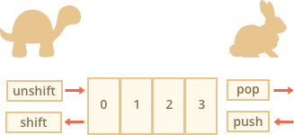

JavaScript
========================================================

> High level programming language for front and back-end development of websites

- First appeared 1995
- ECMAScript was created to standardize JavaScript

Basics
========================================================

## Variables

> Variables are weakly typed, meaning you do not need to specify if there goes a number, string or ... inside 

- **let** value can  change
- **const** is unchangeable, use uppercase letters
- **var** old way of defining variables, do not use anymore see [here](https://davidwalsh.name/for-and-against-let) why

## Naming Conventions

- camelCase for variables
- snake_case for constants
- PascalCase for classes

## Values

- **string**, e.g. "HackYourFuture"
- **number**, e.g. 5, or 10.6
- **boolean**, e.g. true or false
- **array\***, e.g. [1, 2, 3] or ['what', 'is', 'your', 'name']
- **object**, e.g. {name: 'John', age: 24}, or the special object null
- **function**, e.g. function () { return 4; }
- **undefined**

Using `typeof` the value of a variable can be seen

## Operators

- Equality `==`
- Inequality `!=`
- Identity / strict equality `===` (preferred)
- Non-identity / strict inequality `!==` (preferred)
- Greater than operator `>`
- Greater than or equal operator `>=`
- Less than operator `<`
- Less than or equal operator `<=`
- AND `&&`
- OR `||`
- NOT `!`

```
1 == 1 // -> true
7 == '7' // -> true
1 != 2  // -> true
5 === 5  // -> true
9 === '9'  // -> false
3 !== 3 // -> false
3 !== '3' // -> true
```

### Arithmetic Operators

- Addition `+`
- Subtraction `-`
- Multiplication `*`
- Division `/`
- Remainder (sometimes called modulo) `%`

Conditional Operators
========================================================

```
let year = prompt('In which year was ECMAScript-2015 specification published?', '');

if (year < 2015) {
  alert( 'Too early...' );
} else if (year > 2015) {
  alert( 'Too late' );
} else {
  alert( 'Exactly!' );
}
```

Arrays
========================================================

> Fast for working with ordered items

## Declaration

```
let arr = new Array();
let arr = [];
let fruits = ["Apple", "Orange", "Plum"];
```

## Manipulation

- `push(...items)` adds items to the end
- `pop()` removes the element from the end and returns it
- `shift()` removes the element from the beginning and returns it
- `unshift(...items)` adds items to the beginning



Loops
========================================================

## For Loop


```
let arr = ["Apple", "Orange", "Pear"];

for (let i = 0; i < arr.length; i++) {
  alert( arr[i] );
}

// iterates over array elements
for (let fruit of fruits) {
  alert( fruit );
}
```

## While Loop

```
let i = 0;
while (i < 3) { // shows 0, then 1, then 2
  alert( i );
  i++;
}

let i = 0;
do {
  alert( i );
  i++;
} while (i < 3);
```

Functions
========================================================

Using function variables

```
function showMessage() {
  console.log( 'Hello everyone!' );
}

function showMessage() {
  let message = "Hello, I'm JavaScript!"; // local variable

  console.log( message );
}

showMessage(); // Hello, I'm JavaScript!

console.log( message ); // <-- Error! The variable is local to the function
```

Using global variables

```
let userName = 'John';

function showMessage() {
  let message = 'Hello, ' + userName;
  console.log(message);
}

showMessage(); // Hello, John
```

## Default Values

```
function showMessage(from, text = "no text given") {
  console.log( from + ": " + text );
}

showMessage("Ann"); // Ann: no text given
```

## Return Values

```
function sum(a, b) {
  return a + b;
}

let result = sum(1, 2);
alert( result ); // 3
```

Objects
========================================================

> Collection of other variable that belong together

```
let user = {     // an object
  name: "John",  // by key "name" store value "John"
  age: 30        // by key "age" store value 30
};
```

## Computed properties

```
let fruit = prompt("Which fruit to buy?", "apple");
let bag = {};

// take property name from the fruit variable
bag[fruit] = 5;
```

## Property value shorthand

```
function makeUser(name, age) {
  return {
    name: name,
    age: age
    // ...other properties
  };
}

let user = makeUser("John", 30);
alert(user.name); // John

function makeUser(name, age) {
  return {
    name, // same as name: name
    age   // same as age: age
    // ...
  };
}
```

## `in`

```
let user = { name: "John", age: 30 };

alert( "age" in user ); // true, user.age exists
alert( "blabla" in user ); // false, user.blabla doesn't exist
```

## `in` loop

```
let user = {
  name: "John",
  age: 30,
  isAdmin: true
};

for(let key in user) {
  // keys
  alert( key );  // name, age, isAdmin
  // values for the keys
  alert( user[key] ); // John, 30, true
}
```

**When an object variable is copied – the reference is copied, the object is not duplicated.**

```
let user = { name: 'John' };

let admin = user;

admin.name = 'Pete'; // changed by the "admin" reference

alert(user.name); // 'Pete', changes are seen from the "user" reference
```

`map`
========================================================

> Same idea as a `for` loop but with the following advantages

- No writing of a counter requered
- No in between array

```
var tasks = [
  {
    'name'     : 'Write for Envato Tuts+',
    'duration' : 120
  },
  {
    'name'     : 'Work out',
    'duration' : 60
  },
  {
    'name'     : 'Procrastinate on Duolingo',
    'duration' : 240
  }
];

var task_names = [];
 
for (var i = 0, max = tasks.length; i < max; i += 1) {
 
    task_names.push(tasks[i].name);
 
}

var task_names = tasks.map(function (task, index, array) {
 
    return task.name; 
 
});
```

`filter`
========================================================

> Takes an Array and filters out values

```
var difficult_tasks = [];
 
tasks.forEach(function (task) {
    if (task.duration >= 120) {
        difficult_tasks.push(task);
    }
});

var difficult_tasks = tasks.filter(function (task) {
    return task.duration >= 120;
});
 
// Using ES6
var difficult_tasks = tasks.filter((task) => task.duration >= 120 );
```